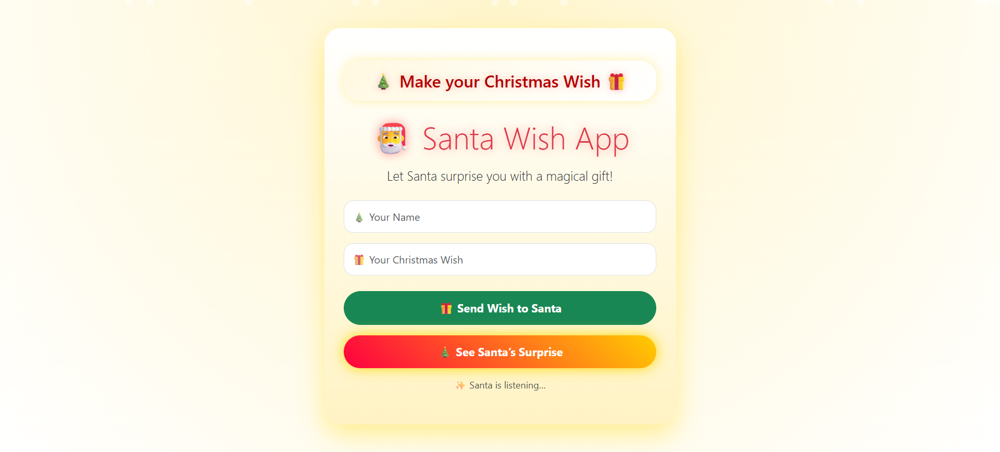
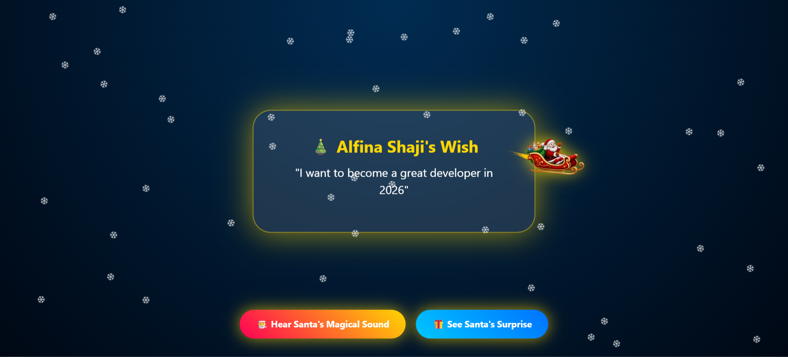
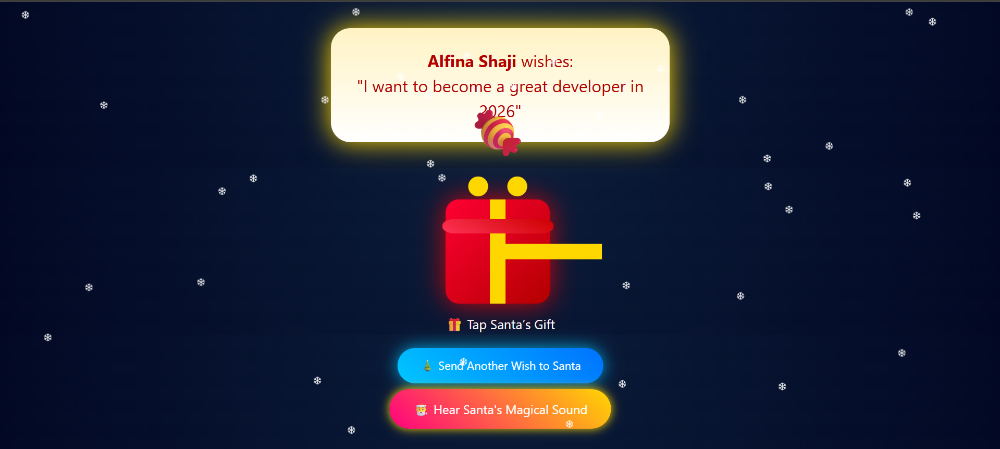

# 🎅 Santa Wish App

The Santa Wish App lets users send Christmas wishes to Santa and enjoy magical animations with snow, sleigh, and surprise effects.

## Features

- Interactive wish input
- Magical surprise animations
- Snowfall animation
- Santa’s sleigh sounds

## Tech Stack

- HTML5
- CSS3
- JavaScript
- Bootstrap 5

## Setup Instructions

1. Clone the repo:
   git clone https://github.com/alfinashaji/Santa-Project

2. Navigate into the folder:
   cd Santa-Project

3. Open `index.html` in your browser.

## Live link
https://69537bd7916017695ebe33eb--splendid-selkie-6df31a.netlify.app/

## Screenshots

## Notes

- Make sure assets like `sleigh.png` and `sleigh-bells.mp3` are in the correct folder.
- For best experience, use modern browsers.
